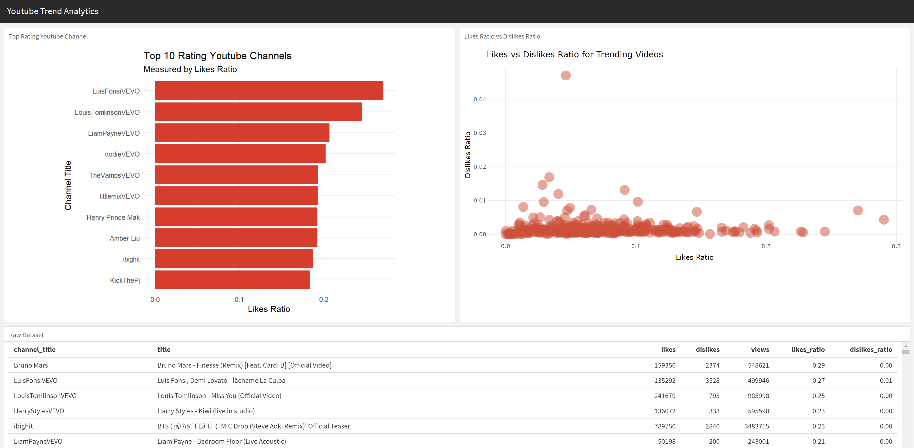

# Kuis Interactive Plotting

Kuis ini merupakan bagian dari proses penilaian *Algoritma Academy*. Selamat anda sudah menyelesaikan materi *Interactive Plotting and Web Dashboard*! Kami akan melakukan penilaian berupa kuis untuk menguji materi yang sudah dipelajari. Pengerjaan Kuis diharapkan dapat dilakukan di dalam kelas, silakan hubungi tim instruktur kami jika Anda melewatkan kesempatan untuk mengambilnya di kelas.

## Memeriksa Data set

Kita akan menggunakan dataset video trending di Youtube yang disimpan di `youtube.csv`. Data tersebut terdiri dari seluruh video trending di Amerika Serikat dari November 2017 hingga Januari 2018 dengan total 2.986 observasi dan 9 variabel. Silakan gunakan glosarium berikut sebagai referensi:
 * `trending_date`: Tanggal video trending
 * `title`: Judul video
 * `channel_title`: Nama kanal (*channel*) Youtube
 * `category_id`: Kategori video
 * `publish_time`: Tanggal video dipublikasikan
 * `views`: Jumlah penonton pada video
 * `likes`: Jumlah penonton yang menyukai video
 * `dislikes`: Jumlah penonton yang tidak menyukai video
 * `comment_count`: Jumlah komentar pada video

Read the dataset into `youtube` object:

```{r}
# Your code here
```

Posisikan Anda bekerja sebagai konsultan analis tren untuk saluran Youtube. Anda mencoba untuk mendapatkan saluran Youtube dengan peringkat teratas pada kategori musik **music**. Metrik yang Anda gunakan untuk menilai setiap saluran adalah rasio antara suka (*likes*) dan penayangan (*views*).

Ambil 10 saluran Youtube teratas berdasarkan rasio suka (*likes ratio*) tertinggi dengan melengkapi kode di bawah ini:

```{r}
 youtube %>% 
   ___(category_id == "Music") %>% 
   group_by(channel_title) %>% 
   ___(likes_ratio = mean(likes/views)) %>% 
   ___(desc(likes_ratio)) %>% 
   head(10)
```
___

1. Fungsi `dplyr` mana yang sesuai untuk mengisi kode di atas?  
  - [ ] filter, summarise,arrange
  - [ ] select, pivot, order
  - [ ] filter, mutate, order
  - [ ] select, summarise, arrange
___

## Membangun Aplikasi Dashboard

Berdasarkan saluran youtube yang telah Anda ekstrak, Anda berencana untuk membuat prototipe *dashboard* untuk klien Anda menggunakan flexdashboard. Anda membuat mockup dengan desain berikut:

___
2. Untuk menghasilkan tata letak (*layout*) menggunakan *templates* flexdashboard, bagaimana seharusnya tata letak disusun?
  - [ ] orientation: rows ; 2 headers in first section, 1 headers in the second section
  - [ ] orientation: columns ; 2 headers in first section, 1 headers in the second section
  - [ ] orientation: columns ; 1 headers in first section, 2 headers in the second section
  - [ ] orientation: rows ; 1 headers in first section, 2 headers in the second section
___

Sekarang perhatikan plot kanan atas. Plot menunjukkan rasio suka dan tidak suka antara video yang sedang tren pada kategori Musik. Misalnya Anda ingin menambahkan fitur interaktivitas yang menarik di mana pengguna dapat memilih kategori yang mereka inginkan dan plot akan berubah sesuai dengan kondisi tersebut.
___
3. Manakah dari jenis masukan (*input type*) di bawah ini yang sesuai untuk jenis pilihan yang diberikan?
  - [ ] selectInput()
  - [ ] sliderInput()
  - [ ] numericInput()
  - [ ] passwordInput()
___
  
Anda juga ingin memiliki plot kanan yang dapat menampilkan setiap judul video untuk analisis lebih lanjut. Karena Anda menyadari bahwa membuat geom_text bisa jadi terlalu penuh untuk plot, Anda berencana merender objek plot yang menampilkan setiap judul video ketika kursor diarahkan. 
___
4. Manakah dari kode berikut yang dipasangkan dengan benar antara render dan output untuk membuat plotly pada *dashboard*?
  - [ ] output$plot1 <- renderPlot({}) ; plotlyOutput("plot1")
  - [ ] output$plotly1 <- renderPlotly({}) ; plotOutput("plotly1")
  - [ ] output$plot1 <- renderPlot({}) ; plotOutput("plot1")
  - [ ] output$plot1 <- renderPlotly({}) ; plotlyOutput("plot1")
 ___
